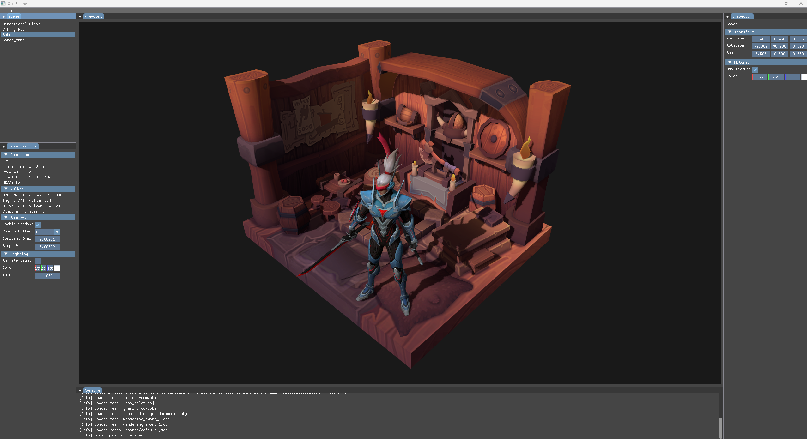
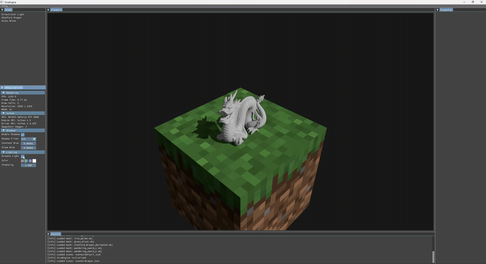

# OrcaEngine

OrcaEngine is a 3D rendering engine and editor written in C++20 using Vulkan 1.3.



### Demo



The demo shows real-time directional lighting controls, light color editing, hard and PCF shadow filtering, and toggling shadows at runtime.

## Features

- Vulkan 1.3 renderer using dynamic rendering and synchronization2
- 8x MSAA with an offscreen scene viewport
- Directional lighting with Phong shading
- Directional shadow mapping
  - Hard shadows
  - PCF filtering
  - Configurable constant and slope bias
- Custom Entity-Component-System (ECS)
- Scene hierarchy and component inspector
- Transform and material editing
- JSON scene serialization
- OBJ mesh and texture loading
- Free-fly editor camera
- Dockable editor interface built with Dear ImGui
- Engine console with Vulkan validation output
- Real-time rendering and Vulkan diagnostics

## Requirements

- **OS:** Windows
- **Language:** C++20
- **Graphics API:** Vulkan 1.3
- **Build System:** CMake
- **GPU:** Vulkan 1.3 compatible GPU
- **Vulkan SDK:** Required for development and validation layers

## Dependencies

OrcaEngine uses:

- [Vulkan](https://www.vulkan.org/)
- [GLFW](https://www.glfw.org/)
- [Dear ImGui](https://github.com/ocornut/imgui)
- [GLM](https://github.com/g-truc/glm)
- [tinyobjloader](https://github.com/tinyobjloader/tinyobjloader)
- [stb](https://github.com/nothings/stb)
- [nlohmann/json](https://github.com/nlohmann/json)

## Build

Clone the repository:

```bash
git clone https://github.com/moisesc112/OrcaEngine.git
cd OrcaEngine
```

Configure and build with CMake:

```bash
cmake -B build
cmake --build build
```

Run OrcaEngine from the project root so runtime assets and scenes can be located correctly.

## Assets / Credits

- **Stanford Dragon** — Stanford University Computer Graphics Laboratory,
  [Stanford 3D Scanning Repository](https://graphics.stanford.edu/data/3Dscanrep/).
  The original mesh was decimated for use in OrcaEngine.
  The Stanford Dragon model remains subject to the usage terms of the Stanford 3D Scanning Repository.

- "**Saber** (Wandering Sword Skin) - MLBB" (https://skfb.ly/pNyPp) by Kenny3D89 is licensed under Creative Commons Attribution (http://creativecommons.org/licenses/by/4.0/).